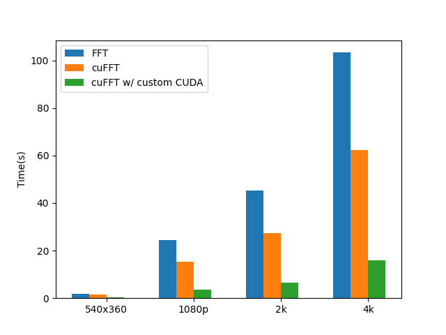

# 毕业设计-Denoising
这是毕业设计-Denoising模块的正式代码

复现了两篇论文

 - Image smoothing via $L_0$ gradient minimization
 - Mesh Denoising via $l_0$ Minimization


也欢迎访问之前更具交互性的jupyter notebook代码仓库

## 相关依赖

使用CPU算法，需要包含

 - numpy
 - scipy

要使用CUDA加速的算法，需要保证当前环境包含`CUDA,CMAKE`，并运行
```bash
pip install pybind11
bash build.sh
```
运行之后将生成`build`文件夹包含中间文件（可删除），以及`lib`文件夹存放供调用的CUDA动态链接库`*.so`

注：CPU算法支持任意平台，目前CUDA算法只支持linux平台; 由于国内原因，submodules的URL均为gitee镜像

## 图像模块

 image.py实现了图像的$L_0$算法，你可以通过
```
python image.py -h
```

 查看所有参数设置

 分别给出了4+1种算法实现：
 - l0：基于CG求解的朴素方法
 - fft：基于FFT的加速（默认）
 - fft_cuda：将FFT替换为cufft进行加速
 - fft_cuda2：在fft_cuda的基础上增加自定义CUDA算子，进一步加速
 - l2：不保特征的平滑（$l2$范数无法保持特征的实验证明）

 同时，为了对比，这里提供了`cv2`的双边滤波器的调用`-m bi`，如果你不需要使用，可以将`import cv2`注释掉
 比如你想将`input/nbu.jpg`作为输入，使用FFT算法，设置$\lambda=0.01$
 ```
 python image.py -l 0.01 --input ./input/nbu.jpg
 python image.py -l 0.01 --input ./input/nbu.jpg -m bi --hdr
 python image.py -l 0.01 --input ./input/nbu.jpg -m fft_cuda
 ```
 如果不指定输出文件，将会在当前路径下生成`res.jpg`

 以下是FFT, cuFFT和$w/$ custom CUDA的运行速度对比，你可以通过执行`python benchmark.py`得到该图片

 

 同时，作为扩展复现了$L_0$论文的后半部分，你可以随意选择以上四种算法（当然优先选最快的），运行以下两种下游任务

  - 细节增强
  - HDR

 如果你想要使用基于$l0$的图像增强算法，添加`--enhance`，如果你想要使用基于$l0$的HDR算法，添加`--hdr`（请不要同时添加两个，否则一项会被忽略），为了代码简单，采用预设参数，不会提供相关的更多参数设置，如有需要请在代码内部直接修改（位于`Solver`类的`detail_magnification()`方法）

## 网格模块

## TODO
目前HDR的compression factor直接设置成0.2，没有进一步按照02年那篇设置成自适应的，而且生成结果看上去也不大对，尤其是$L_0$的方法

##毕业设计相关
执行以下脚本获得相应section的配图
```
bash hdr.sh
python benchmark.py
```


## 参考资料
https://www.cse.cuhk.edu.hk/~leojia/projects/L0smoothing/
https://people.csail.mit.edu/fredo/PUBLI/Siggraph2002/
https://pybind11.readthedocs.io/en/stable/basics.html
https://docs.nvidia.com/cuda/cufft/index.html#using-the-cufft-api